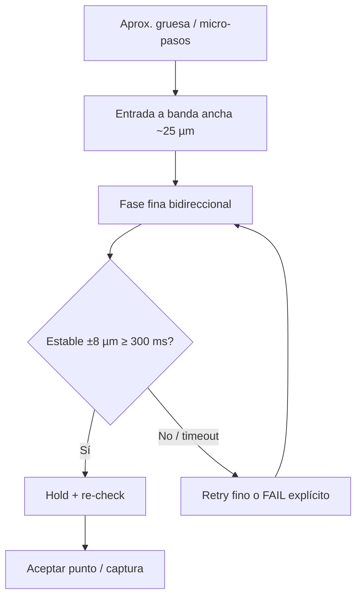

# Plan de implementación: precisión sub-FOV (pocos micrómetros)

| Campo | Valor |
|-------|-------|
| **Fecha** | 2026-07-13 |
| **Hora** | 14:19 (UTC-4) |
| **Proyecto** | XYZ_Ctrl_L206_GUI + MycoViT_XY_Controller |
| **Contexto** | FOV cámara ≈ 120×120 µm; residual de 20 µm ≈ 17 % del campo (inaceptable para mosaico) |
| **Evidencia** | `motor_control_20260713.log` (corridas 13:43–13:46) |
| **Estado** | Pendiente de ejecución |
| **Dependencia de velocidad** | `plan_arquitectura_control_rapido_ui30hz_2026-07-13.md` |
| **Plan de implementación** | `Docs/20260714_0032_Plan_Implementacion_Control_Micrometrico_Rapido.md` (2026-07-14 00:32) |

---

## 1. Objetivo principal (meta de producto)

**Al llegar a cada punto FOV de la trayectoria, estabilizar y mantener ambos ejes dentro de ±8 µm respecto al nominal durante ≥ 300 ms, con tasa de aceptación válida ≥ 95 % en una fila completa (≥ 10 puntos consecutivos), sin oscilación sostenida > ±25 µm.**

Justificación FOV 120 µm:

| Residual | % del FOV | Uso |
|----------|-----------|-----|
| ±20 µm | ~17 % | Inaceptable (pérdida de solape / seam visible) |
| ±10 µm | ~8 % | Límite operativo mosaico |
| **±8 µm** | **~7 %** | **Meta primaria de este plan** |
| ±5 µm | ~4 % | Meta stretch (fase 4) |
| ~3 µm (1 LSB) | ~2.5 % | Piso físico del sensor actual |

Capacidad ya demostrada en log: punto 1 con `tol_fov=25` → `err=(1.5, −2.9) µm`. El sistema **puede** llegar; no puede **sostener ni exigir** esa precisión de forma repetible.

---

## 2. Problemas a resolver (diagnóstico cerrado)

### P1 — Criterio de aceptación confundido con tamaño FOV
- El campo UI *Tolerancia* alimenta `tol_fov_um`.
- Corrida con tolerancia **120** aceptó puntos con residuales **46–92 µm** en ~40 ms.
- Corrida con **50** aceptó **13–30 µm**.

### P2 — Actuación bang-bang cerca del objetivo
- `step_pwm_min = step_pwm_cap = 80` → golpe fijo cerca de banda.
- Micro-pasos con overshoot de cientos de µm (`err` 456…923 µm en log).

### P3 — Zona muerta ≈ tolerancia efectiva
- `deadzone_adc = 8` → ~**23.6 µm**; `tol_ef ≈ 25 µm`.
- El lazo deja de corregir antes de la banda fina deseada (5–8 µm).

### P4 — FOV_VERIFY unidireccional
- `_fov_approach_allows_pwm` solo actúa desde el lado de avance.
- Overshoot no se corrige → oscilación / hang (punto 2, `tol_fov=25`, ±50–250 µm ~26 s).

### P5 — Settling demasiado corto
- `SETTLING_CYCLES = 4` @ ~100 Hz ≈ **40 ms**.
- El residual crece tras “OK” (creep / inercia) mientras el punto ya se aceptó.

### P6 — Hold post-aceptación débil
- Tras aceptar, no hay fase explícita de mantenimiento fino antes de pausa/captura.

---

## 3. Metas e indicadores (KPI)

### 3.1 Metas principales (Must-have)

| ID | Meta | Indicador medible | Umbral de éxito | Fuente |
|----|------|-------------------|-----------------|--------|
| **M1** | Cierre por punto | `\|residual_x\|` y `\|residual_y\|` al `FOV_VERIFY OK` | ≤ **8 µm** en ≥ 95 % de puntos | Log `FOV_VERIFY OK: err=` |
| **M2** | Estabilidad temporal | Tiempo continuo dentro de banda ±8 µm antes de aceptar | ≥ **300 ms** | `t_verify` + contador settling |
| **M3** | Sin falsa aceptación | Si UI tol ≥ FOV/10, bloquear o clampear | Nunca aceptar con tol > 12 µm sin confirmación explícita | UI + log `tol_fov=` |
| **M4** | Sin hang FOV | Tiempo máximo en `FOV_VERIFY` por punto | ≤ **8 s** o fallo explícito (no oscilar infinito) | Log ticks / timeout |
| **M5** | Overshoot controlado | Pico de `\|err\|` en micro-paso fino (Δref ≤ 50 µm) | ≤ **40 µm** en P95 | Stall / step logs |

### 3.2 Indicadores de proceso (Should-have)

| ID | Indicador | Baseline (2026-07-13) | Meta intermedia | Meta final |
|----|-----------|----------------------|-----------------|------------|
| **I1** | Residual mediano al OK (fila 10 pts) | ~20–60 µm (tol 50–120) | ≤ 12 µm | ≤ 8 µm |
| **I2** | Residual P95 al OK | ~90 µm | ≤ 20 µm | ≤ 12 µm |
| **I3** | `t_verify` mediano | 40 ms (falso OK) / 6–10 s (lucha) | 0.4–1.5 s | 0.3–1.0 s |
| **I4** | Tasa de puntos “OK válidos” (err≤8 µm **y** t_verify≥300 ms) | ~0–10 % | ≥ 70 % | ≥ 95 % |
| **I5** | Stall warnings por punto (`err`>100 µm en paso fino) | Frecuentes | ≤ 2 / punto | ≤ 0.5 / punto |
| **I6** | Drift post-OK en 500 ms (PWM hold) | No medido / visible en log | ≤ 10 µm | ≤ 5 µm |

### 3.3 Meta stretch (fase 4, opcional)

- **M-S1:** banda ±**5 µm** estable ≥ 300 ms en ≥ 90 % de puntos (ruido ~1 LSB ≈ 2.9 µm).
- **M-S2:** compensación de backlash medida (hoy `backlash=(0,0)` en log).

### 3.4 Definición de “OK válido” (única fuente de verdad)

Un punto cuenta como éxito **solo si** se cumplen **todas**:

1. `abs(err_x) ≤ tol_accept` y `abs(err_y) ≤ tol_accept` con `tol_accept = 8.0` µm (configurable).
2. Condición (1) sostenida ≥ `T_settle_ms = 300` ms con sensores frescos.
3. Durante esa ventana, PWM de corrección fina acotado (`|pwm| ≤ pwm_fine_cap`) o 0 en hold.
4. Al finalizar, re-lectura: residual aún ≤ `tol_accept` (anti-creep).

---

## 4. Arquitectura de la solución (fases)



Separar explícitamente tres bandas:

| Banda | Tol (µm) | PWM | Integral | Sentido |
|-------|----------|-----|----------|---------|
| **Coarse** | 25–80 | cap 80–135, floor opcional | Sí | Micro-pasos / approach |
| **Fine** | 8–12 | cap 25–40, **floor 0** | Opcional / bajo | Bidireccional |
| **Hold** | 8 | 0 o creep mínimo | No | Mantener |

---

## 5. Plan de implementación por fases

### Fase 0 — Instrumentación y contrato de métricas (0.5–1 día)

**Qué**
- Separar en UI/logs: `FOV size` vs `tol_accept` vs `tol_step`.
- Emitir línea de métrica por punto:  
  `POINT_METRICS idx residual=(rx,ry) t_verify_ms peak_err settle_ms accepted_valid=0|1`
- Script o filtro grep para resumen P50/P95 de una corrida.

**DoD**
- Tras una trayectoria de prueba, se puede calcular I1–I4 sin inspección manual línea a línea.

**Archivos**
- `test_tab_ui_builder.py`, `test_tab.py`, `step_controller.py`, `test_service.py`

---

### Fase 1 — Criterio de aceptación y guardrails UI (0.5 día)

**Qué**
1. Renombrar / tipificar campo: **Tolerancia de cierre (µm)** ≠ FOV.
2. Default `tol_accept = 8.0`; clamp blando: si usuario pone > `min(FOV)/10` (p.ej. 12), warning + no aplicar sin confirmar.
3. `settling` mínimo en tiempo (`T_settle_ms`), no solo N ciclos fijos a 40 ms.
4. No cablear `tolerance_input` a un `tol_fov` laxo que acepte basura.

**DoD**
- Con UI en 8 µm, el log nunca muestra `tol_fov=120` aceptando err=90 µm.
- M3 cumplida.

**Riesgo**
- Trayectorias “rápidas” actuales dejarán de avanzar hasta arreglar P2–P4 → esperado.

---

### Fase 2 — Actuación fina + deadzone por fase (1–1.5 días) — impacto alto

**Qué**
1. **PWM floor desacoplado:**
   - Coarse: mantener `step_hinf_pwm_min` / cap actuales si hace falta vencer fricción.
   - Fine / FOV_VERIFY: `pwm_min = 0`, `pwm_cap_fine ≈ 25–40`.
2. **Deadzone por fase:**
   - Coarse: `deadzone_adc` 4–8.
   - Fine: `deadzone_adc` 1–2 (≈ 3–6 µm).
3. Desactivar o limitar `PwmCritEstimator` floor aprendido (=80) en fase fina.
4. Ajustar `effective_tol_step_um` para que en fine no fuerce `max(..., 25)` si la meta es 8 (revisar acoplamiento con `POSITION_TOLERANCE_UM`).

**DoD**
- En micro-paso Δ≤50 µm, P95 de pico de error ≤ 40 µm (M5).
- El lazo sigue corrigiendo con residual 8–20 µm (hoy para en ~24 µm).

**Archivos**
- `step_config.py`, `step_controller.py`, `hinf_actuator.py`, `pwm_crit_estimator.py`, `calibration.json` / defaults `step_control`

**Parámetros iniciales propuestos**

```json
"step_control": {
  "tol_fov_um": 8.0,
  "tol_step_um": 12.0,
  "deadzone_adc": 2,
  "step_pwm_cap": 80,
  "step_pwm_cap_fine": 35,
  "step_pwm_min": 0,
  "step_hinf_pwm_min": 40,
  "fov_settle_ms": 300,
  "fov_pwm_cap": 35
}
```

---

### Fase 3 — FOV_VERIFY bidireccional + timeout + hold (1.5–2 días) — crítico

**Qué**
1. En fase fina: **permitir PWM en ambos sentidos** cuando `|err| > tol_accept` (eliminar o relajar `_fov_approach_allows_pwm` unidireccional).
2. Conservar approach unidireccional solo en coarse si aporta anti-backlash; en fine priorizar precisión.
3. Unlock si eje locked y `|err| > 2×tol` (ya existe parcialmente; verificar con tol=8).
4. Timeout FOV_VERIFY (p.ej. 8 s) → retry fino (1–2) o `FAILED` con métrica, nunca loop infinito.
5. Tras banda estable: **Hold 200–300 ms** (PWM 0 o creep acotado) + re-check residual antes de `_finish_point`.
6. Settling por tiempo: `settle_ms` con sensores fresh, no solo 4 ticks.

**DoD**
- Reproducir escenario punto 2 del log (tol 25 → hoy hang): con fix, cierra en ≤ 8 s con residual ≤ 8 µm o FAIL claro.
- M1, M2, M4 cumplidas en banco de 10 puntos de una fila.

**Archivos**
- `step_controller.py` (`_fov_approach_allows_pwm`, `_tick_fov_verify`, `_finish_point`)
- `test_service.py` (propagación de `fov_settle_ms`)

---

### Fase 4 — Validación en planta + stretch (1 día + iteración)

**Qué**
1. Protocolo de prueba fijo (ver §6).
2. Ajuste fino Kp/Ki solo si tras Fases 2–3 el residual sistemático > 8 µm (no retocar H∞ antes).
3. Opcional: estimar backlash (ida/vuelta 100 µm) y aplicar `backlash_*` en ref FOV.
4. Stretch: `tol_accept = 5 µm` si ruido lo permite.

**DoD**
- Informe de corrida con I1–I6 vs baseline.
- Decisión go/no-go para mosaico real.

---

## 6. Protocolo de prueba y métricas de aceptación

### 6.1 Setup fijo
- Mapa: A→Sensor 2, B→Sensor 1; Invert PWM según planta (no resetear al start).
- Controladores transferidos A≠B (slots `A_*` / `B_*`).
- Trayectoría: 1 fila, ≥ 10 puntos, paso FOV ≈ 120–163 µm (el del sistema).
- `tol_accept = 8`, `pause ≥ 1 s` (para medir drift).

### 6.2 Corridas
1. **Baseline** (antes de cambios, si aún reproducible) — 10 puntos.
2. **Post Fase 2** — misma trayectoria.
3. **Post Fase 3** — misma trayectoria (aceptación formal del plan).

### 6.3 Extracción de métricas (por corrida)
Por cada `FOV_VERIFY OK` / `POINT_METRICS`:
- residual abs max, residual abs mean
- `t_verify_ms`
- flag `accepted_valid`
- conteo de `WARNING` stall con `|err|>100`

Criterio de cierre del plan (release gate):

```
I4 ≥ 95 %
I1 ≤ 8 µm
I2 ≤ 12 µm
I3 ∈ [300, 1500] ms (mediana)
M4: 0 hangs > 8 s
```

---

## 7. Orden de trabajo y dependencias

```text
Fase 0 (métricas)
    ↓
Fase 1 (guardrails UI / tol)
    ↓
Fase 2 (PWM fino + deadzone)  ──┐
    ↓                            │  pueden solaparse en review
Fase 3 (FOV bi-dir + settle)  ←─┘
    ↓
Fase 4 (validación planta)
```

**No** empezar por re-sintetizar H∞: el log ya mostró ~2 µm; el pipeline de cierre es el cuello.

**No** subir tolerancia para “hacer avanzar” la trayectoria: eso falsea M1.

---

## 8. Riesgos y mitigaciones

| Riesgo | Impacto | Mitigación |
|--------|---------|------------|
| Friction: `pwm_min=0` no mueve en fine | Hang en banda 10–20 µm | Creep acotado / piso adaptativo bajo (p.ej. 15) solo si `|err|` no baja en N ticks |
| Ruido ADC ~1 LSB | Falso unsettling | Banda 8 µm + filtro media móvil corta (3–5 muestras) en criterio settle |
| Invert / mapa mal | Residual sistemático | Enforce sensor canónico; invert solo UI |
| Timeout agresivo | Falsos FAIL | 8 s + 1 retry fino antes de FAIL |
| Cambiar `POSITION_TOLERANCE_UM` global | Rompe dual control | Tolerancias por modo (dual vs trajectory fine) |

---

## 9. Entregables

1. Este plan (documento vivo; actualizar §10 al cerrar fases).
2. Cambios de código en Fases 0–3.
3. Parámetros `step_control` documentados en `calibration.json` / template.
4. Log de validación + tabla I1–I6 (Fase 4).
5. Nota corta en README o comentario de UI: FOV ≠ tolerancia de cierre.

---

## 10. Seguimiento de ejecución

| Fase | Estado | Fecha cierre | Notas |
|------|--------|--------------|-------|
| 0 Instrumentación | Implementado | 2026-07-13 | Línea `POINT_METRICS` en `_finish_point` (residual, t_verify, retries, settle_ms, accepted_valid) |
| 1 Guardrails UI | Implementado | 2026-07-13 | Campo "Tolerancia cierre" default 8 µm + confirmación si > FOV/10 (`_confirm_tolerance_vs_fov`) |
| 2 PWM/deadzone fino | Implementado | 2026-07-13 | `fov_pwm_cap=40` + `_clamp_fov_pwm`; `pwm_crit.pwm_cap` reducido en FOV; `fov_creep_adc=6`, cooldown=20 |
| 3 FOV bi-dir + settle/hold | Implementado | 2026-07-13 | `_fov_approach_allows_pwm` bidireccional; sin locks permanentes; settle temporal `fov_settle_ms=300`; timeout `8000ms` + retry `×2` |
| 4 Validación planta | Pendiente | — | Requiere banco real (protocolo §6) |

**Owner sugerido:** control/GUI (Python). Firmware STM32: sin cambios previstos salvo que el creep mínimo requiera PWM más granular (verificar resolución actual del comando `A,a,b`).

---

## 11. Resumen ejecutivo

| Pregunta | Respuesta |
|----------|-----------|
| ¿Qué hay que conseguir? | Residual estable **≤ 8 µm** ≥ **300 ms** en ≥ **95 %** de puntos FOV |
| ¿Por qué? | FOV 120 µm → 20 µm de error es demasiado para mosaico |
| ¿Qué lo impide hoy? | tol UI mal usada, deadzone ~24 µm, PWM=80 fijo, FOV unidireccional, settle 40 ms |
| ¿Qué no es el foco aún? | Re-diseñar H∞ (ya llegó a ~2 µm una vez) |
| ¿Cómo se sabe que listo? | Gate §6.3 sobre 10+ puntos de una fila real |

---

*Documento creado: 2026-07-13 14:19 (UTC-4).*  
*Basado en análisis de `motor_control_20260713.log` y código de `step_controller` / `step_config` / `test_service`.*
